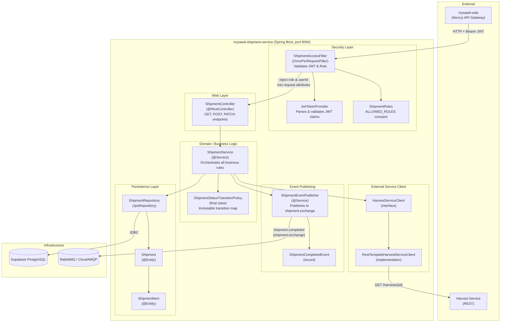
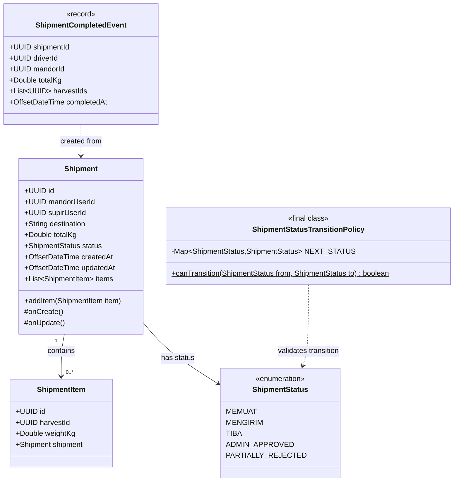
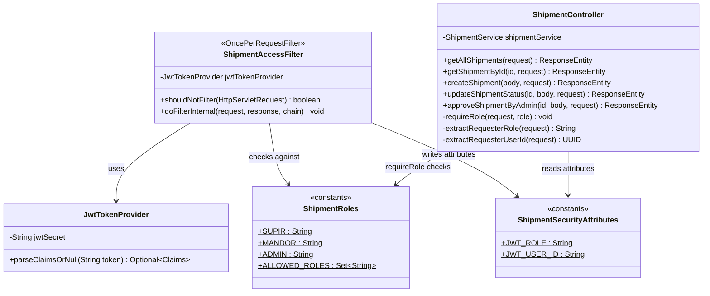
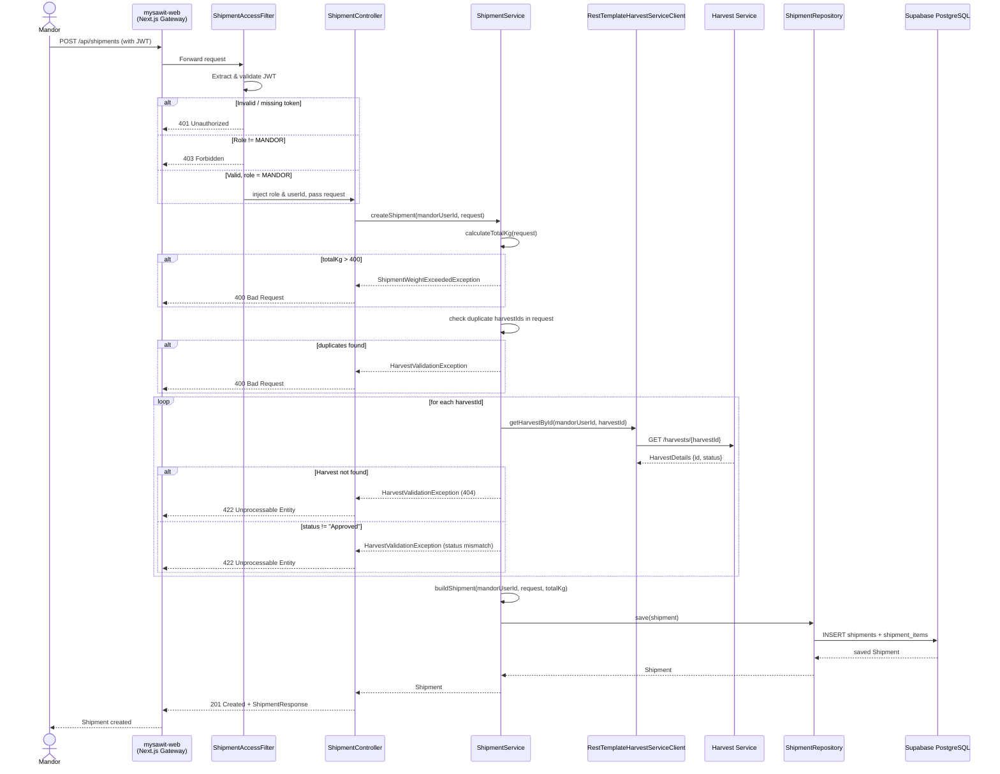
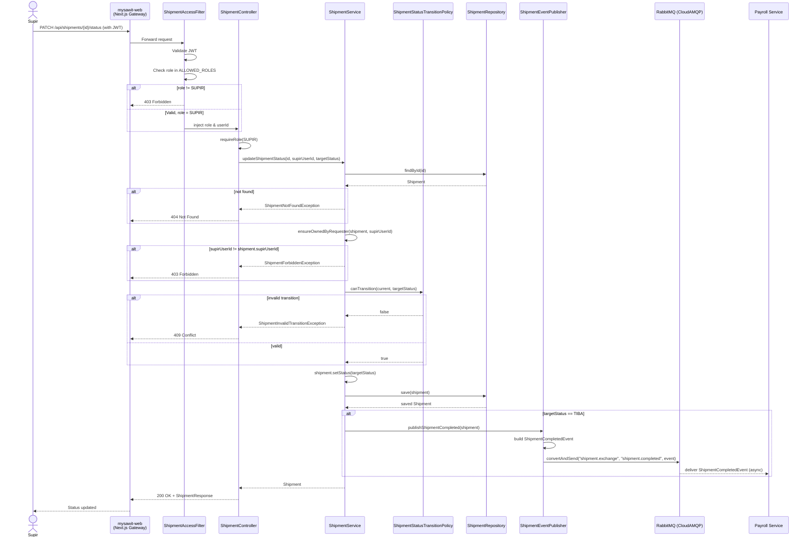

# Individual Works

- Nama: Made Shandy Krisnanda
- NPM: 2406495615

## MySawit: Shipment Service & Frontend (mysawit-web)

> **Tutorial B: Visualizing and Architectural Risk**
> Berdasarkan Container Diagram kelompok, dokumen ini memperluas diagram tersebut dengan Component Diagram dan empat Code Diagram yang berkaitan dengan kontribusi individual saya.

---

## 1. Component Diagram — Shipment Service

Component diagram ini memperbesar tampilan ke dalam container `mysawit-shipment-service`, memperlihatkan komponen-komponen internal dan cara mereka berinteraksi satu sama lain serta dengan container eksternal.

---

## 2. Code Diagram 1 — Class Diagram: Domain Model

Model data inti dari shipment service, menampilkan entitas-entitas, atribut, relasi antar entitas, dan enum status pengiriman.

---

## 3. Code Diagram 2 — Class Diagram: Security Layer

Memperlihatkan bagaimana komponen-komponen keamanan berinteraksi untuk mengautentikasi dan mengotorisasi request yang masuk sebelum mencapai controller.

---

## 4. Code Diagram 3 — Sequence Diagram: Create Shipment (MANDOR)

Menggambarkan alur lengkap ketika MANDOR membuat shipment baru, mencakup validasi JWT, validasi panen via REST, pengecekan batas berat, dan penyimpanan ke database.

---

## 5. Code Diagram 4 — Sequence Diagram: Update Status & Event Publishing (SUPIR)

Menggambarkan alur ketika SUPIR memperbarui status pengiriman, mencakup pengecekan kepemilikan, validasi state machine, dan penerbitan event ke RabbitMQ saat shipment mencapai status `TIBA`.

