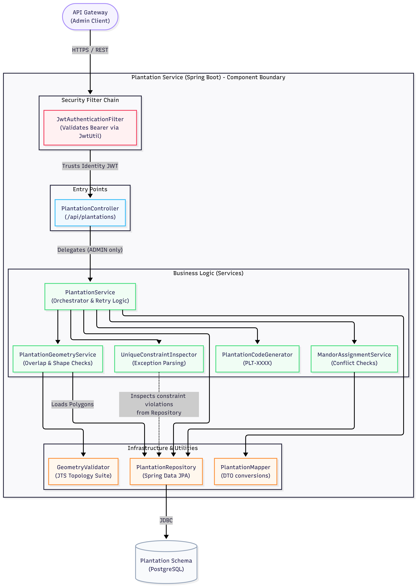
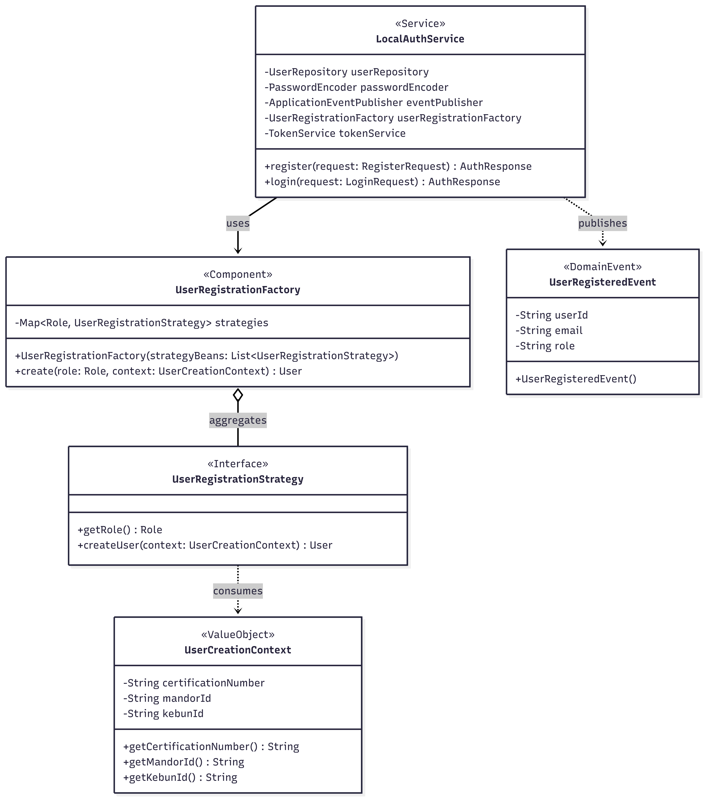
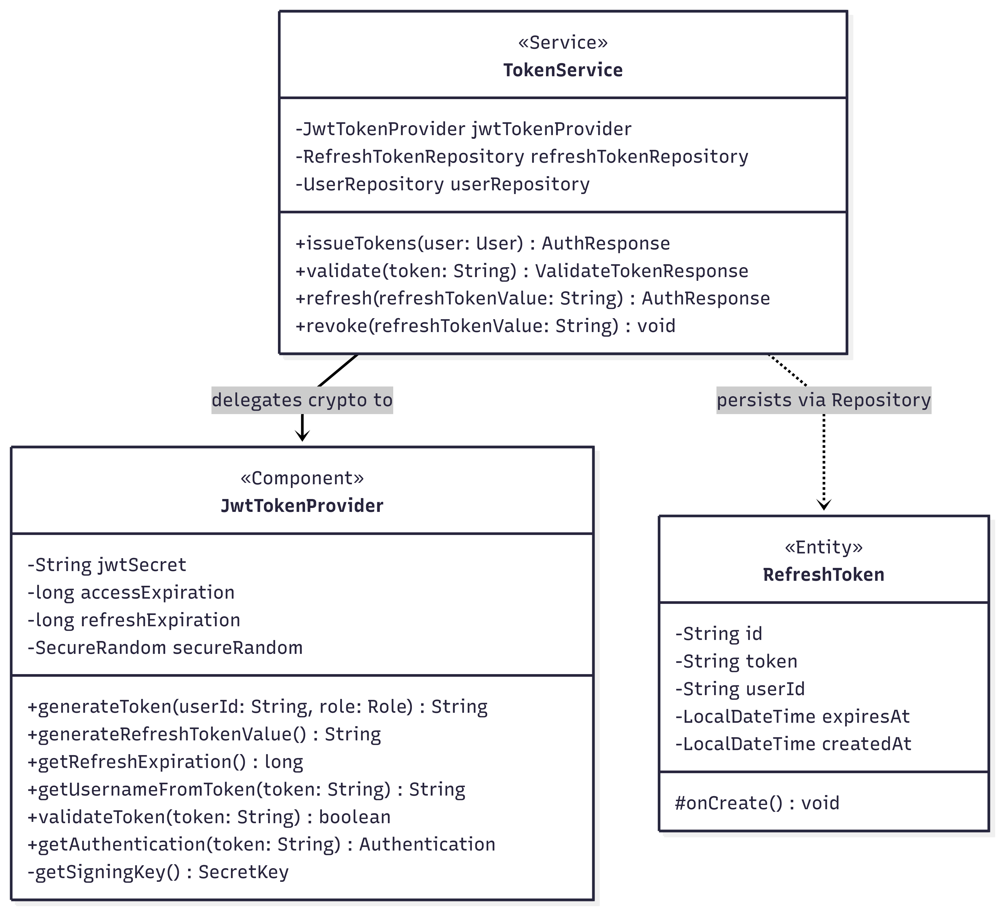
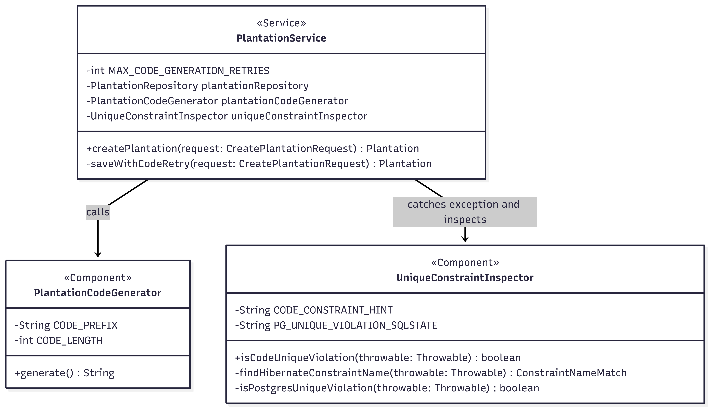
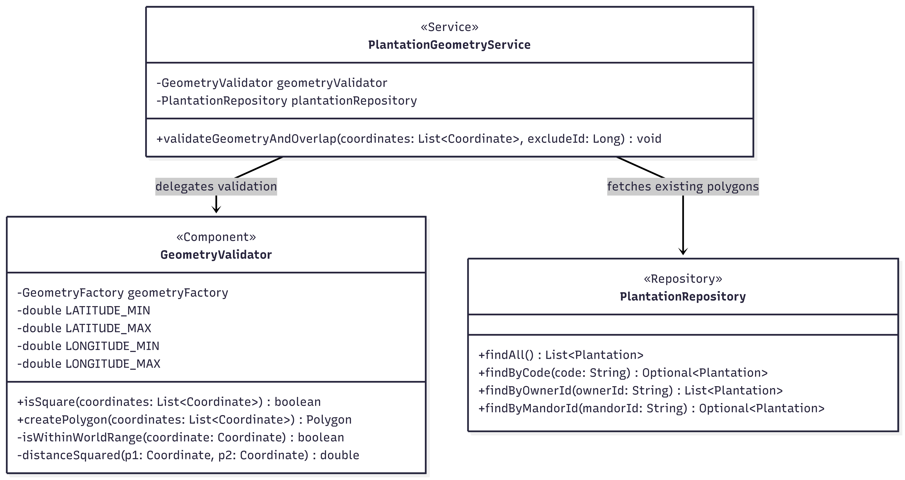

# Individual Works

- Nama: Muhammad Hadziqul Falah Teguh
- NPM: 2406437432

## Component Diagram : Identity

## Component Diagram : Plantation

## Code Diagram : Identity — Registration Strategy & Event

## Code Diagram : Identity — Token Generation

## Code Diagram : Plantation — Retry Logic

## Code Diagram : Plantation — Spatial Logic

