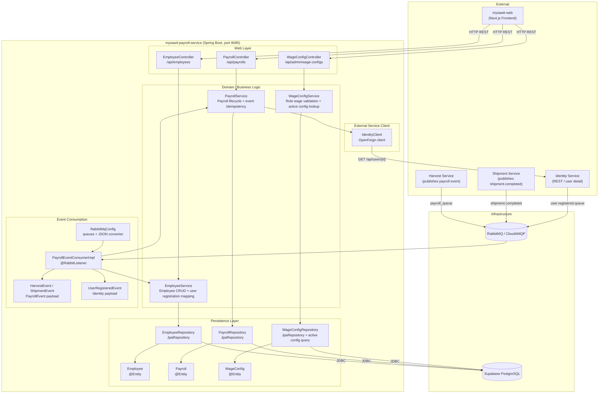
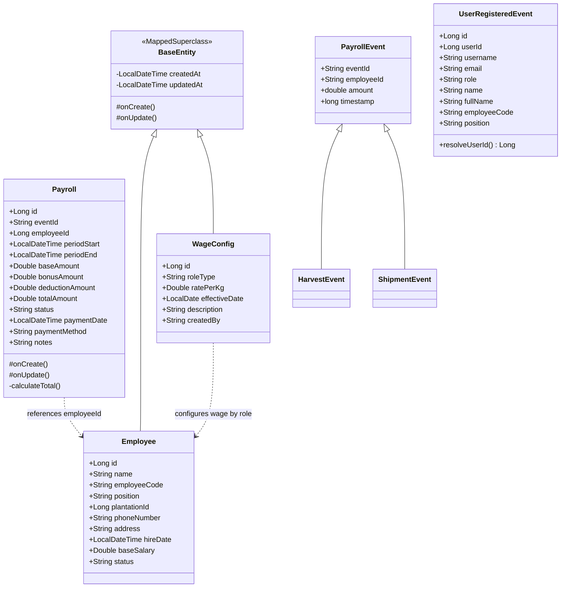
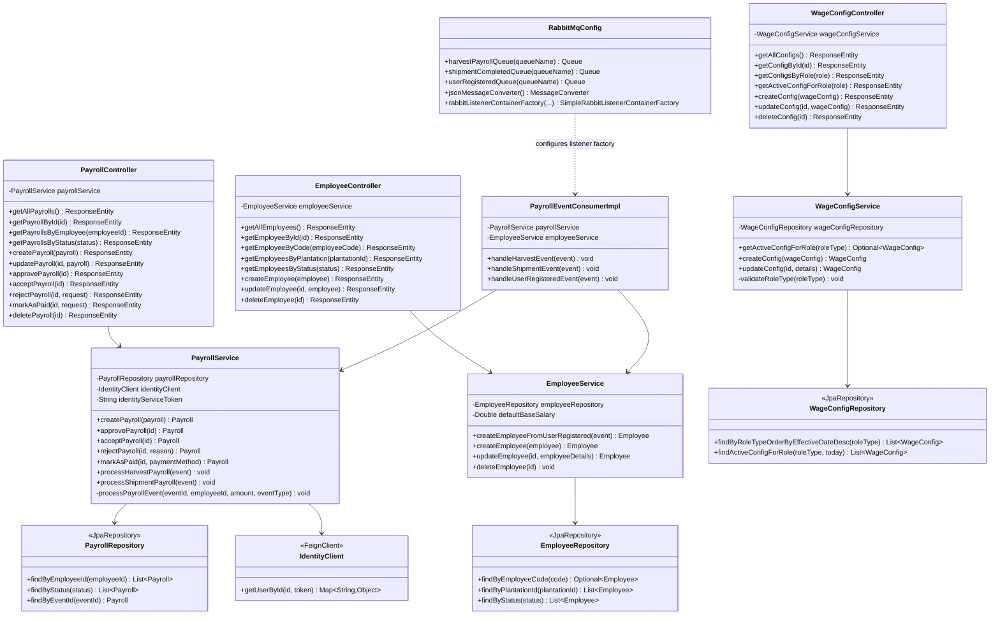
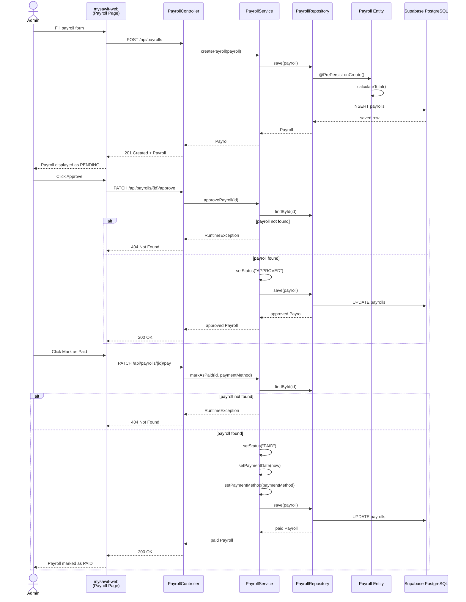
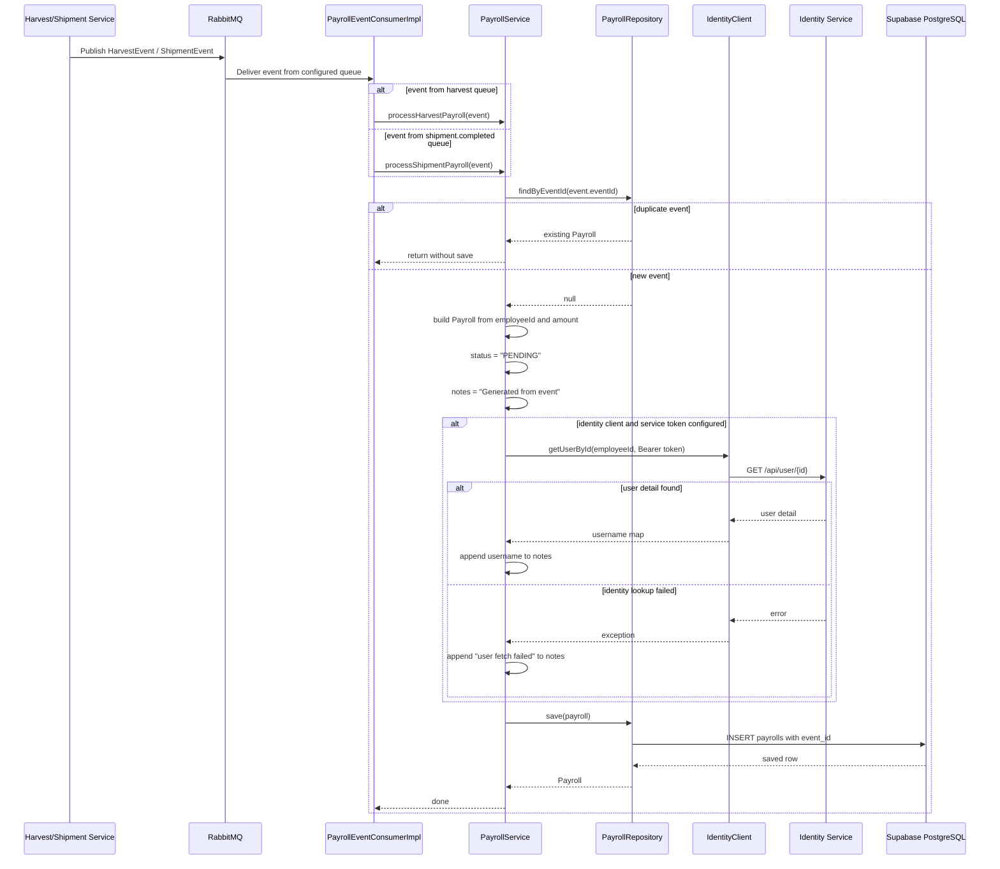

# Individual Works

- Nama: Muhammad Hamiz Ghani Ayusha
- NPM: 2406360413

## MySawit: Payroll Service & Frontend Integration

> **Tutorial B: Visualizing and Architectural Risk**
> Berdasarkan Container Diagram kelompok, dokumen ini memperluas diagram tersebut dengan Component Diagram dan empat Code Diagram yang berkaitan dengan kontribusi individual saya pada domain Payroll.

---

## 1. Component Diagram - Payroll Service

Component diagram ini memperbesar tampilan ke dalam container `mysawit-payroll-service`, memperlihatkan komponen internal untuk manajemen employee, payroll, konfigurasi upah, konsumsi event RabbitMQ, serta integrasi dengan container eksternal.

---

## 2. Code Diagram 1 - Class Diagram: Domain Model

Model data inti dari payroll service, mencakup entitas yang disimpan di database dan payload event yang dikonsumsi dari RabbitMQ.

---

## 3. Code Diagram 2 - Class Diagram: REST, Service, Repository, and Messaging

Diagram ini memperlihatkan pembagian tanggung jawab antar controller, service, repository, RabbitMQ consumer, dan client eksternal.

---

## 4. Code Diagram 3 - Sequence Diagram: Manual Payroll Lifecycle

Menggambarkan alur saat admin atau frontend membuat payroll secara manual, lalu mengubah status payroll dari `PENDING` menjadi `APPROVED` dan akhirnya `PAID`.

---

## 5. Code Diagram 4 - Sequence Diagram: Event-Driven Payroll Generation

Menggambarkan alur pembuatan payroll secara asinkron ketika Harvest Service atau Shipment Service mengirim event ke RabbitMQ. Payroll Service memastikan idempotency dengan `eventId` agar event yang sama tidak membuat payroll ganda.

