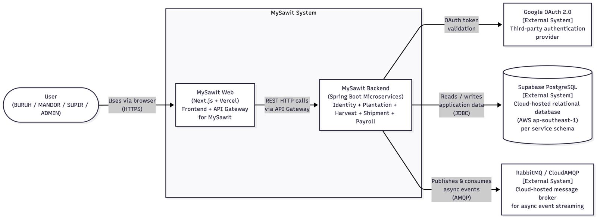
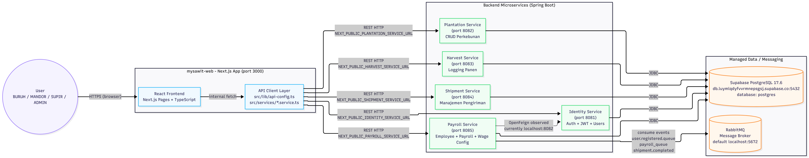
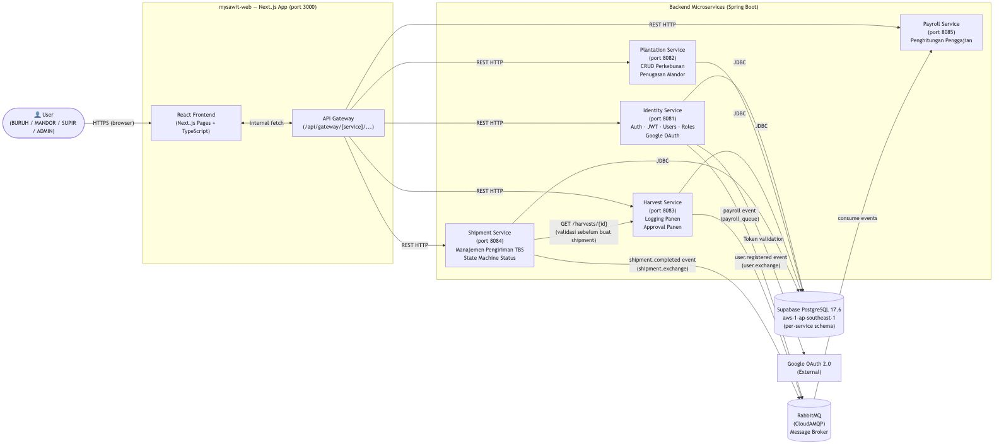
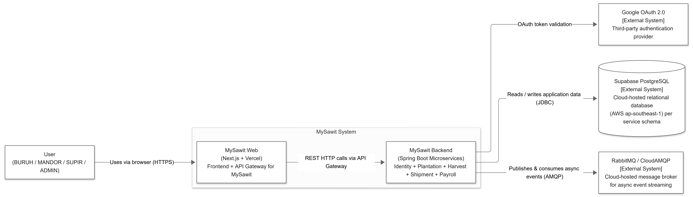
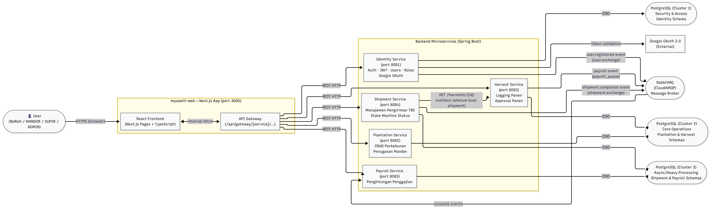

# Group Discussion

**Kelompok A07**

- Muhammad Hadziqul Falah Teguh / 2406437432
- Muhammad Hamiz Ghani Ayusha / 2406360413
- Nadia Aisyah Fazila / 2406495584
- Made Shandy Krisnanda / 2406495615

---

## Context Diagram Now

## Deployment Diagram

## Container Diagram Now

## Context Diagram Future

## Container Diagram Future

## Future Architecture Analysis

### 1. Identifikasi Risiko Arsitektur Saat Ini

**Nama Risiko:** Shared Physical Database Instance (Titik Kegagalan Tunggal / SPOF).

**Komponen Terdampak:** Seluruh layanan (Identity, Plantation, Harvest, Shipment, Payroll) dan Supabase PostgreSQL.

**Analisis Risiko:** Sistem saat ini menggunakan pendekatan per-service schema secara logis, namun secara fisik seluruh lima mikroservis bergantung pada satu instance database Supabase yang sama.

**Penilaian Metriks:**

- **Overall Impact (Dampak):** 3 (Tinggi). Jika database tumbang, seluruh sistem MySawit lumpuh total.
- **Likelihood (Peluang):** 2 (Sedang).
- **Risk Score:** 6 (High Risk).

**Skenario Kegagalan ("Noisy Neighbor"):** Layanan Payroll yang melakukan agregasi data berat di akhir bulan dapat memonopoli penggunaan CPU dan koneksi (I/O bottleneck). Hal ini dapat menyebabkan layanan Identity mengalami timeout, sehingga pengguna tidak bisa melakukan proses login, meskipun domain autentikasi sebenarnya tidak mengalami masalah logika.

### 2. Usulan Perbaikan

Untuk mengurangi skor risiko di atas, mitigasi yang dilakukan adalah menerapkan pola Domain-Aligned Database Partitioning. Shared database tunggal dipecah menjadi 3 klaster fisik yang terpisah berdasarkan afinitas data dan profil beban kerja, yaitu:

- **Cluster 1 (Security & Access):** Didedikasikan khusus untuk Identity Service.
- **Cluster 2 (Core Operations):** Digunakan bersama oleh Plantation Service dan Harvest Service karena keduanya memiliki keterikatan relasional operasional yang tinggi.
- **Cluster 3 (Async & Heavy Processing):** Digunakan bersama oleh Shipment Service dan Payroll Service yang lebih banyak bekerja secara asinkron (via RabbitMQ) dan memproses kalkulasi/agregasi berat.

### 3. Justifikasi Modifikasi

Modifikasi arsitektur ini didasarkan pada prinsip utama arsitektur perangkat lunak bahwa setiap keputusan adalah sebuah trade-off. Pada arsitektur awal, penggunaan satu instance fisik (meskipun skemanya dipisah) memberikan ilusi dekomposisi layanan. Secara nyata, arsitektur tersebut menciptakan Single Point of Failure (SPOF) dan mengundang risiko "Noisy Neighbor", di mana satu layanan dengan query berat (seperti penggajian) dapat memonopoli sumber daya CPU/RAM database dan melumpuhkan layanan kritis lainnya seperti autentikasi (Identity).

Dengan beralih ke pola Domain-Aligned Database Partitioning yang menggunakan tiga klaster, kita secara efektif membatasi Blast Radius (dampak kerusakan) ketika terjadi kegagalan. Jika database operasional (Cluster 3) mengalami kelebihan beban dan mati saat kalkulasi gaji akhir bulan, database autentikasi (Cluster 1) dan kebun (Cluster 2) tetap berjalan normal. Pengguna tetap dapat login dan mencatat panen tanpa hambatan, memastikan ketersediaan (krusial vitality) dari jalur bisnis utama MySawit tidak terputus.

Pendekatan tiga klaster ini juga merupakan kompromi arsitektural yang paling rasional (fokus pada "Mengapa" bukan sekadar "Bagaimana"). Pemisahan ke dalam lima database murni (Database-per-Service) akan membawa beban biaya infrastruktur dan kompleksitas operasional yang terlalu tinggi untuk skala MySawit saat ini. Pengelompokan berdasarkan afinitas operasional (seperti menggabung Plantation dan Harvest) menyeimbangkan kebutuhan akan isolasi performa dengan efisiensi biaya.
